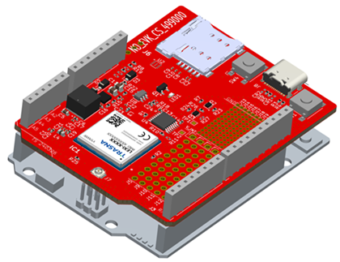

# Trasna LEXI-R10 Arduino schield board

The LEXI-ADAM UNO Shield is an open-source cellular expansion board for the Arduino UNO or Arduino UNO Q platforms. It uses the ultra-small LEXI-R10 series or ADAM-R11 series LTE Cat 1bis cellular modules. 

The Cellular module can be turned ON/OFF and Reset by the Arduino board. The shield has its own step down to deliver power to the cellular module; the stepdown too can be turned ON/OFF by an Arduino GPIO to minimise power consumption. The input voltage range of the shield is the same as Arduino's range. 

The Arduino UNO  communicates with the Cellular module via UART, and by default, this communication is without RTS/CTS handshake. The shield already supports RTS/CTS handshake by easy soldering jumpers. The proper modifications must be made also to the MCU firmware of Arduino (R7FA4M1AB3CFM for UNO, or STM32U585 for UNO Q) to support hardware handshake. To achieve communication with the Linux system of Arduino UNO Q, the Arduino Bridge feature should be used. For even higher higher communication rates with the Linux system the USB port of the UNO Q must be connected to the USB port of the shield.
 
The shield also features two breadboarding areas for experimenting with own circuits. They have 2.54mm and 1.27mm pitch and are provided with 3.3Volts, 1.8Volts and GND for powering the circuits that the user might implement.

All the hardware design source files, including Schematic, PCB board, gerbers, stack-up, can be downloaded from the present repository. Also the firmware examples running on Arduino UNO R4 WIFI and on Arduino UNO Q can be found here.

The user guide explaining the board can be downloaded from: [LEXI-ADAM_Arduino_UNO_Shield_UserGuide](https://drive.google.com/file/d/1tEk1xlIRyrKd_FjjbZdSfsDOfKxhqTxc/view).
